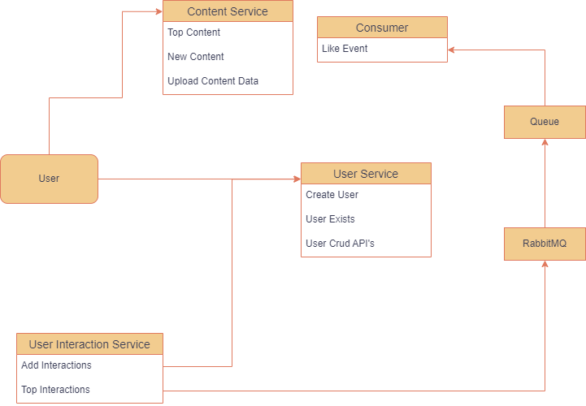

# Pratilipi-Assignment

To run the project run:

1) docker-compose build
2) after it builds the whole thing run docker-compose up

Custom Content Data has been provided in the data folder.

The custome content data assumes that the user_id present in the csv already exists in the user service database.
To create a user POST request to this endpoint http://localhost:8001/users/ and provide the username and password in the body of the request.

Documentation for services:
Content-services: http://localhost:8000/docs/
User-services: http://localhost:8001/docs/
User-interaction-services: http://localhost:8002/docs/

# High Level Design

# Low Level Design

## User Service:
  1) UserExistsView: This view is used by the user-interaction-service to check if the user exists. It is exposed as users/exisits/id in the API
  2) UserListCreateView: This view can list all the users present in the system as well as create a user. It is exposed as users/ in the API
  3) UserRetrieveUpdateDes: This view can retrieve a single user, also update a single user and delete a single user. It is exposed as users/pk in the API
  4) UserSerializer: This is the serializer for serializing the User model.
  5) Endpoint users/auth_token is used to obtain auth token for a user present in the system. This could be used for authentication in future development.

## Content Service:
  1) UploadFileView: This view takes a CSV file from the request and starts a celery worker to start ingesting the data present in the CSV to the database. 
  It is exposed as content/ingest-data/ in the API.
  2) NewContentView: This view will get and sort the content on the basis of date_pubished so that content with recent dates are available on the top.
  It is exposed as content/new-content/.
  3) TopContentView: This view gets the most liked and read content from the user interaction service by calling it through a API call and takes their content_id and 
    returns the top content data to the user. It is exposed as content/top-content/ in the API.
  4) ContentCreateView: This view lists and creates the contents. It is exposed as content/ in the API.
  5) ContentRetrieveUpdateDes: This view retrieves, updates and deletes a single content.

### Consumer:
   Its a rabbitmq consumer which is listening to a queue called 'like' and whenever there is a event in this queue it triggers a celery task named like_event which takes the content_id present in the body of the event and it fetches the content by its id and increases its like by 1. This event is produced in the user interaction service when a api endpoint is called for liking a content.

## User Interaction Service:
   1) InteractionView: This view adds a interaction in the database, interactions are of two type Like and Read. It first checks if the user exists by calling an API to user exists API. If the interaction type is like it produces an like event which is added in the rabbitmq queue. This event is consumed by the consumer running in the content service.
   2) TopInteractionsView: This view filters the interaction table and gets the most liked and read interactions and returns the result, this view is used by the content service Topcontentview to get the best content(most liked and read).
    
